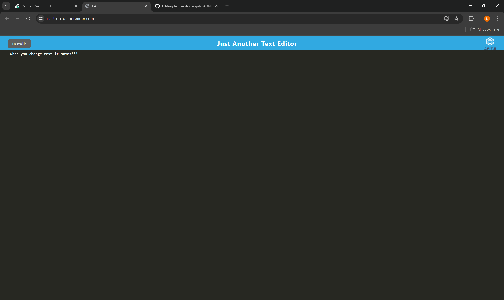
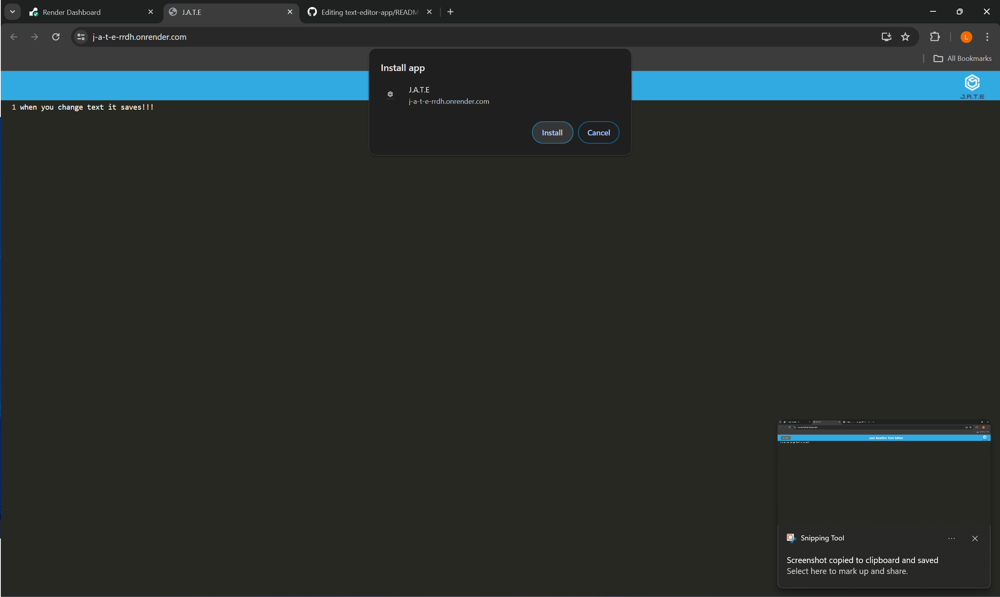
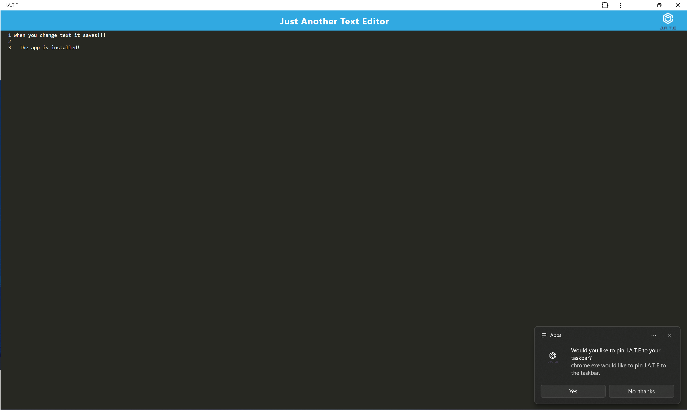

# J.A.T.E

## Description
I was given J.A.T.E as a project in where I add offline functionality and installability through the use of webpack and tools such as inject manifest and pwa manifest. It was a good exercise and introduction to a topic I'm new to. It gave me good knowledge on how to create a manifest configuration and some of the common properties I would use. I learnt how to register a service worker for use and how to use indexDB as a key value pair database

## Installation
No installation needed, simply follow my render link here: https://j-a-t-e-rrdh.onrender.com

## Usage
Once on the site you can enter text into the editor. When the editor loses focus it will save to the database. You can install this app onto your device by clicking the install button as shown below:

## Credits
n/a

## License
n/a

## Contributing
n/a

## Tests
n/a

## Questions
for any questions you can reach me at: leewheeler123@gmail.com 

or visit my github profile: github.com/LWSE13
